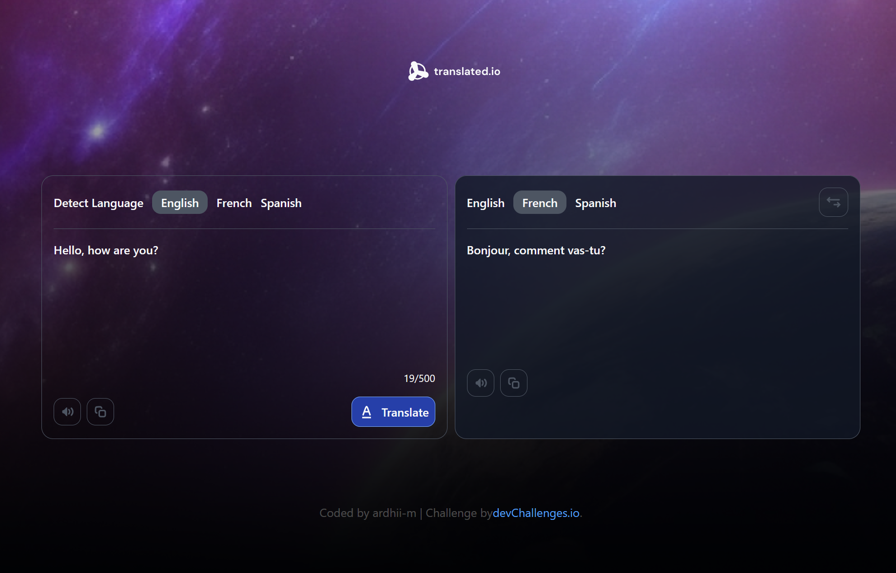

<h1 align="center">ardhii-m | devChallenges</h1>

   Solution for a challenge <a href="https://devchallenges.io/challenge/translate-app" target="_blank">Translate app</a> from <a href="http://devchallenges.io" target="_blank">devChallenges.io</a>.

  <h3>
    <a href="https://translating-app-ardm.netlify.app/">
      Demo
    </a>
     | 
    <a href="https://devchallenges.io/challenge/translate-app">
      Challenge
    </a>
  </h3>

<!-- TABLE OF CONTENTS -->

## Table of Contents

- [Overview](#overview)
  - [Useful resources](#useful-resources)
- [Built with](#built-with)
- [Features](#features)
- [Contact](#contact)
- [Acknowledgements](#acknowledgements)

<!-- OVERVIEW -->

## Overview

Simple Translation Web application.

### Useful resources

- [Copy to clipboard in React](https://www.geeksforgeeks.org/reactjs/how-to-copy-text-to-the-clipboard-in-react-js/) - For helping "Copy to clipboard" feature.

### Built with

- Semantic HTML5 markup
- Flexbox
- CSS Grid
- [React](https://reactjs.org/)
- [Tailwind](https://tailwindcss.com/)

## Features

- Multi-language Translation
- Auto Language Detection
- Instant Language Switching
- Copy to Clipboard

This application/site was created as a submission to a [DevChallenges](https://devchallenges.io/challenges-dashboard) challenge.

## Author

- GitHub [ardhii-m](https://{github.com/ardhii-m})
